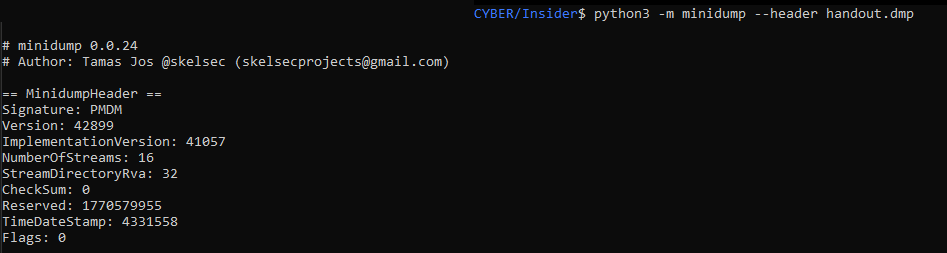
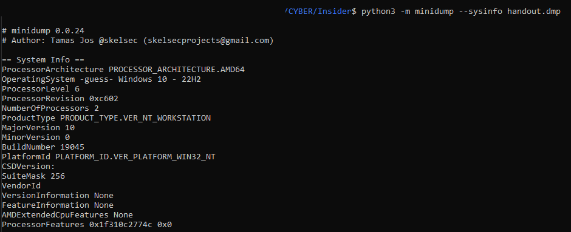
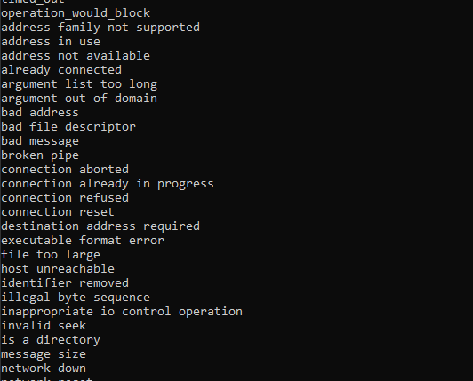
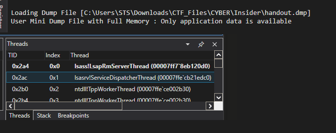
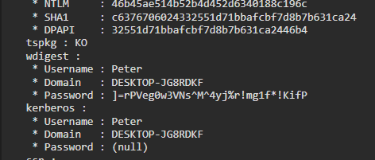
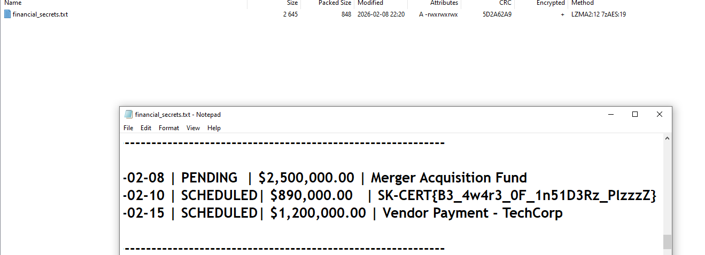

# Insider Challenge

**Category:** Forensics / Memory Analysis
**Flag:** `SK-CERT{B3_4w4r3_0F_1n51D3Rz_PlzzzZ}`

---

## Description

Peter, a disgruntled ex-employee, encrypted `financial_secrets.txt` before walking out the door. He left behind a password-protected archive and took the password with him. Or so he thought.

The challenge hands you two files: `encrypted.7z` and `handout.dmp`. The password mixes uppercase, lowercase, digits, and symbols. You're told upfront not to brute force it. That constraint isn't just a rule. It's a hint telling you exactly where to look.

---

## Step 1

Before touching any tool ... you need to know what you're actually dealing with.
A `.dmp` file could be a crash dump, a full memory image, or a process snapshot.

```bash
python3 -m minidump --header handout.dmp
```



The header clears things up fast:

```
== MinidumpHeader ==
Signature: PMDM
```

That `PMDM` signature identifies a Windows MiniDump.
This isn't a full raw memory image. It's a process-scoped snapshot.
Keep that distinction in mind because it'll rule out a lot of tooling later.

Next, pull the system info:

python3 -m minidump --sysinfo handout.dmp

```



```

ProcessorArchitecture: AMD64

BuildNumber: 19045

````

Windows 10 22H2, 64-bit. Noted  ... which process got dumped?

---

## Step 2

Quick triage first. Run `strings` across the dump and grep for anything obvious.

```bash
strings -a handout.dmp | grep -i "password"
strings -a handout.dmp | grep -i "7z"
strings -a handout.dmp | grep -i "financial"
````


Windows dumps store a lot of text as UTF-16LE ... so cover that encoding too:

```bash
strings -a -e l handout.dmp | grep -i "password"
strings -a -e l handout.dmp | grep -i "secret"
strings -a -e l handout.dmp | grep -i "7z"
```


What comes back is noise.
DLL paths, registry fragments, authentication package names, binary data that happens to render as ASCII.

---

---

## Step 3

Maybe Peter ran 7-Zip from a shell. If he typed something like:

```
7z a encrypted.7z financial_secrets.txt -pSomePasswordHere
```

...
that command may still linger in memory through `cmd.exe` ...
PowerShell history or PSReadLine or console host buffers

Search for shell artifacts: `7z a`, `7z.exe`, `-p`, `encrypted.7z`, `financial_secrets.txt`, `powershell.exe`, `cmd.exe`, `conhost.exe`, `PSReadLine`.

```
C:\Program Files\7-Zip\7z.exe
C:\Users\Peter\Desktop\
```

Nothing. No `-p` switch, no command line, no trace of archive creation. A reasonable path to check, but a dead end.

---

## Step 4

Run the dump through a file-analysis scanner.
The output file comes back loaded with threat-intelligence-style data: extracted file objects, registry keys, packed-file indicators, URLs, Windows security references.

Some carved artifacts show up too. A few resemble PNG headers and DLL-like structures, so those get a quick look.


LSASS memory is full of material that triggers scanner heuristics, so this path feels plausible.

None of the artifacts contain the archive password, though. The useful takeaway is actually a negative one

this isn't a malware-analysis challenge.

---

## Step 5

````bash
python3 ./volatility3/vol.py -f handout.dmp windows.info
python3 ./volatility3/vol.py -f handout.dmp windows.pslist
python3 ./volatility3/vol.py -f handout.dmp windows.crashinfo


Volatility builds its memory address space layers from full physical memory captures.


No actionable output. This isn't Volatility's fault. It's the wrong tool for this dump type. Always identify the dump format first, then choose your tooling.

---

## Step 6

Here's where things shift. List the modules embedded in the MiniDump:

```bash
python3 -m minidump --modules handout.dmp
````

```
C:\Windows\System32\lsass.exe
```


`lsass.exe` is the Local Security Authority Subsystem Service. It owns authentication on Windows.

Dump `lsass.exe` and you capture a snapshot of whatever credential material was live in that process at the time.


handout.dmp is an LSASS process dump
Peter had an active logon session at dump time
LSASS may hold Peter's plaintext credential
Peter's Windows password may be the archive password

````

---

## Step 7

With LSASS confirmed, `pypykatz` is the natural next move. It's built specifically to parse LSASS dumps and extract credential material.

```bash
pypykatz lsa minidump handout.dmp

It finds Peter's session immediately:

````

username: Peter
domainname: DESKTOP-JG8RDKF
sid: S-1-5-21-651026828-2995092438-3424030943-1002

```

It also pulls real authentication material: NT hash, SHA1 hash, DPAPI masterkey, logon session identifiers, DPAPI key GUIDs. All of that gets saved to `pypykatz.json`.

However, the WDigest block is empty. No plaintext password.


 The parser failed to locate the WDigest structure due to a signature or offset mismatch ??

well  this option turns out to be correct.
`pypykatz` hunts for WDigest using known byte signatures and fixed offsets.
When the in-memory layout doesn't match what the parser expects, it skips the block entirely. The credential is still in memory. The parser just walked past it.

That's the main trap in this challenge.

---

## Step 8
now we use the correct tool ... well after enough search online i found out i can use windbg for this challenge

WinDBG is Microsoft's own debugger.
It reads MiniDump files natively without needing to reconstruct memory layers the way Volatility does.

The real trick though is mimilib.dll ...  which is the WinDBG extension that ships with Mimikatz.
Where mimikatz.exe runs as a standalone binary, mimilib.dll plugs directly into WinDBG's debugging context and walks LSASS memory structures from inside the debugger itself.

That access is exactly why it catches the WDigest credential that pypykatz missed


Open WinDBG, load the dump, and try calling `!mimikatz` before loading the extension DLL:


---

## Step 9

Open `handout.dmp` in WinDBG x64:

```

File -> Open Dump File -> handout.dmp

```

Initialize symbols:

```

.symfix
.reload

```

Since the dump scopes directly to the LSASS process, there's no need for kernel-mode enumeration. Stay in user-mode LSASS memory.



Now load the Mimikatz WinDBG extension:

```

.load C:\Tools\x64\mimilib.dll

```

The extension banner confirms the DLL loaded correctly:

```

mimikatz 2.2.0 (x64)
WinDBG extension

```


## Step 10

Run the credential extraction command from the WinDBG prompt:

```

!mimikatz sekurlsa::logonPasswords

```

Peter's active session surfaces:

```

Username : Peter
Domain : DESKTOP-JG8RDKF

```

Inside the WDigest block, the plaintext credential is right there:

```

Password : ]=rPVeg0w3VNs^M^4yj%r!mg1f\*!KifP




Save the full session output to `mimikatz_dump_output_1024_2026-03-04_22-06-53-767.txt` for the record.

---

## Step 11

Use the recovered password to extract the archive:

```bash
7z x encrypted.7z
```

Enter the password when prompted:

```
]=rPVeg0w3VNs^M^4yj%r!mg1f*!KifP
```

`financial_secrets.txt` drops out cleanly.

---


## Step 12

Open `financial_secrets.txt`. The flag is in the pending transactions section.



```
SK-CERT{B3_4w4r3_0F_1n51D3Rz_PlzzzZ}
```

---

## Tools Used

`minidump` - MiniDump header, sysinfo, and module parsing
`strings` - Raw ASCII and UTF-16LE extraction
`grep` - Pattern filtering
`Volatility 3` - Full memory analysis attempt (incompatible with MiniDump)
`pypykatz` - Automated LSASS credential parsing
`decrypt_dpapi.py` / `decrypt_blob.py` - Custom DPAPI blob carving and parsing
`WinDBG x64` - Native debugger for MiniDump analysis
`mimilib.dll` - Mimikatz native WinDBG extension
`7-Zip` - Archive extraction

Mimikatz project: https://github.com/gentilkiwi/mimikatz
